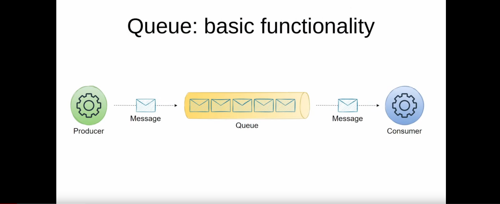

# What are Messaging Queues and Enterprise Message Bus?

- A Message queues is an asynchronous message middleware used in inter-communication of services. They mainly store information packets received from a producer application. The message packets are then sent to the respective consumer application.

- Messaging Queues makes a service architecture more reliable. The Concept of messaging queue mainly deals with queuing the information from the producer application and sends it accordingly to the consumer application. 

- This queuing helps the service to retain the information in the system even if the consumer may not be available to receive the information. Later when the consumer is ready for fresh packets of information the message queue deploys fresh packets of information to the consumer.

## Purpose Of Messaging Queue

- Decoupling is a major issue commonly faced by microservices architecture. Messaging Queue solves this problem by decoupling the architecture. The decouple happened because now all the application have to send the message through the messaging queue.

- Messaging Queues allows for buffering of messaging in case the producer and consumer application are not in sync in real time. This allows for more resilient inter-communication between applications.

- Increased application independency, Messaging queue allows the producer to keep working and sending message packets even if the consumer is unable to take more orders. It happens because the extra orders from the producer is stored in the messaging queue and later sent to the consumer when it's ready.

- Fault Tolerance, even if the consumer experience a fault and is unable to take orders the system does'nt break. The remaining orders are then redirected to the remaining servers or consumers by the messaging queue.

## Key Components

- Message Producer:  This is the application that creates a message containing data and sends it to the message queue. It doesn't wait for the message to be processed, allowing it to continue with other tasks.

- Message Queue:  This acts as a central hub, storing messages from producers until consumers are ready to receive them. It ensures messages are delivered in the order they were sent and can handle situations where the consumer is unavailable.

- Message Consumer:  This is the application that retrieves messages from the queue and processes the data they contain. Consumers can work independently, taking messages at their own pace.

## Popular Messaging Queue Tools

- [Apache Kafka](https://kafka.apache.org/) : Open source platform for stream-handling between servers.
- [RabbitMQ](https://www.rabbitmq.com/): It is a streaming broker, easy to deploy on cloud environments and local machines.
- [Amazon SQS](https://docs.aws.amazon.com/ja_jp/AWSJavaSDK/latest/javadoc/com/amazonaws/services/sqs/AmazonSQS.html): Highly scalable for storing messages between microservices.

## What is an Enterprise Message Bus?

- An enterprise message bus is an application used for smooth communication between various services in large companies. Think of it like an application used by a company to make communication between different departments, teams and individuals seamless.

- The message bus is based on **publish-subscribe** data model where the message produced by the producer is received by the users subscribed by that channel.

- It supports different messaging protocols like JMS, MQTT and many other. These protocols define message format ,guarantees message delivery and many such features.

## How Message Bus Works

- Applications Talk: Different programs (applications) in your system need to send information to each other. Imagine them as colleagues needing to share updates.

- Publish, Don't Call: Instead of calling each other directly, applications "publish" messages on a central message bus. Think of it like a bulletin board in the office hallway.

- Subscribe for Updates: Applications can "subscribe" to specific topics on the bus. This lets them know when interesting messages are posted, kind of like signing up for specific news feeds.

- The Bus Delivers: The message bus delivers messages to all applications subscribed to the relevant topic. It's like the bulletin board automatically showing updates to interested colleagues.

## Enterprise Message Bus vs Message Queue

- Message bus is based on point-to-point data model whereas Enterprise Message Bus is based on publish-subscribe data model. However, message bus can also use point-to-point model.
- Message queue like a waiting line, where messages are put in a queue and other applications process them accordingly.The message bus is like a bulletin board, where anyone can post message, people choose which topic they're interested in.
- Message queue can give reliable message delivery while message bus can't guarantee the order of messages to be delivered.

## Conclusion

Message queues and enterprise message buses (EMBs) are essential tools in modern software systems. Message queues enable asynchronous communication, allowing different parts of an application to send and receive messages without waiting for each other, making systems more reliable and scalable.

### References Links:

- https://www.youtube.com/watch?v=5-Rq4-PZlew
- https://www.ibm.com/topics/message-queues
- https://dev.to/billy_de_cartel/a-beginners-guide-to-understanding-message-bus-architecture-22ec.
- https://www.trustradius.com/message-queue
- https://aws.amazon.com/message-queue/
- https://learn.microsoft.com/en-us/azure/service-bus-messaging/service-bus-messaging-overview
